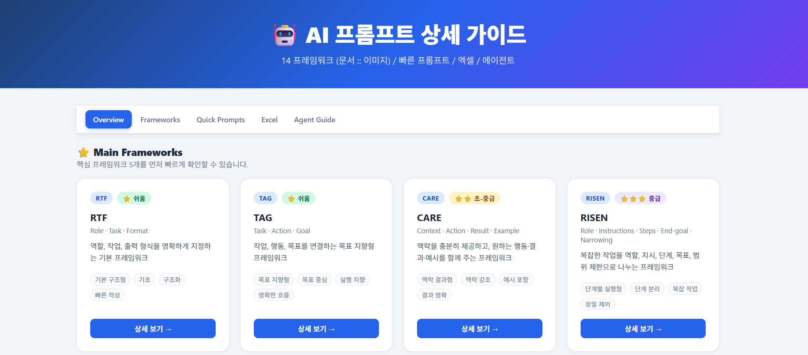

# AI 프롬프트 프레임워크 가이드

  

  실무 중심 AI 프롬프트 활용 가이드

📘 **AI Prompt Framework Guide**는 AI를 보다 효과적으로 활용하기 위한 **프롬프트 작성 방법과 프레임워크를 정리한 인터랙티브 가이드**입니다.

본 프로젝트는 **HTML / CSS / JavaScript 기반의 웹 가이드**로 제작되었으며 GitHub Pages를 통해 바로 확인할 수 있습니다.

---

# 가이드 바로 보기

🌐 **사이트**

https://neovue-it.github.io/AI_Prompt_Guide/

---

# 개요

많은 사용자들이 AI를 사용할 때 다음과 같은 문제를 경험합니다.

- 원하는 결과가 나오지 않는다
- 프롬프트 작성 방법을 모른다
- 매번 다른 방식으로 질문한다

이 가이드는 이러한 문제를 해결하기 위해 다음을 제공합니다.

- 프롬프트 프레임워크 정리
- 실무 예시 프롬프트
- 즉시 사용할 수 있는 템플릿
- AI 활용 방법 가이드

---

# 주요 기능

## 프롬프트 프레임워크

총 **14개의 프롬프트 프레임워크**를 제공합니다.

예시:

- **RTF** : Role · Task · Format
- **TAG** : Task · Action · Goal

각 프레임워크에는 다음 정보가 포함됩니다.

- 사용 상황
- 간단 예시
- 문서 프롬프트 예시
- 이미지 프롬프트 예시
- 예상 출력 결과

---

## 프레임워크 비교

각 프레임워크의 특징과 차이를 비교하여 **어떤 프레임워크를 사용할지 쉽게 판단**할 수 있습니다.

---

## Quick Prompt 템플릿

실무에서 바로 사용할 수 있는 **Quick Prompt 템플릿**을 제공합니다.

예시:

- 보고서 작성
- 문서 요약
- 아이디어 생성
- 데이터 분석
- 회의 정리

---

## Excel / 데이터 프롬프트

데이터 분석 및 스프레드시트 작업을 위한 프롬프트 예시를 제공합니다.

예시:

- Excel 데이터 분석
- 함수 설명
- 데이터 요약
- 데이터 구조 분석

---

# 향후 개발 계획

향후 **Wrks.ai 플랫폼의 AI 에이전트 및 챗봇 활용 가이드**가 추가될 예정입니다.

예정 내용:

- 상황별 AI 에이전트 선택 방법
- 에이전트 활용 워크플로우
- 에이전트 기반 프롬프트 예시
- 실무 활용 사례

---

# 목적

이 가이드는 다음 목표를 가지고 제작되었습니다.

- AI 활용 장벽 낮추기
- 프롬프트 작성 방법 표준화
- 실무 생산성 향상
- 조직 내 AI 활용 확대

---

# 문서 안내

## English Documentation

- [Project Progress](./docs/en/PROGRESS.md)
- [Project Roadmap](./docs/en/ROADMAP.md)

## 한국어 문서

- [프로젝트 진행 현황](./docs/kr/PROGRESS_KR.md)
- [프로젝트 개발 로드맵](./docs/kr/ROADMAP_KR.md)

---

# 브랜치 구조

## `main`

기존 단일 페이지 기반 레거시 버전입니다.  
현재는 참고용으로만 유지됩니다.

## `second`

현재 메인 개발 브랜치이자 실제 작업 기준 브랜치입니다.

주요 방향:
- 모듈형 구조
- Shared Rendering 시스템
- Workflow 중심 UI
- 웍스AI Enterprise Workflow Guide

## `third` (예정)

향후 `second` 브랜치를 기반으로 생성될 사내용 Enterprise 배포 브랜치입니다.

---

# 개발 방향

본 프로젝트는 단순 AI Prompt Reference 사이트에서 시작하여, 현재는 모듈형 Workflow 기반 Enterprise AI Adoption Platform 형태로 확장 중입니다.

현재 주요 개발 방향:

- Foundation AI 교육
- Prompt Engineering 가이드
- Workflow 기반 AI 활용
- 웍스AI 운영 가이드
- Enterprise AI 온보딩
- 부서별 AI Workflow 예제
- Shared Rendering 구조 개선

---